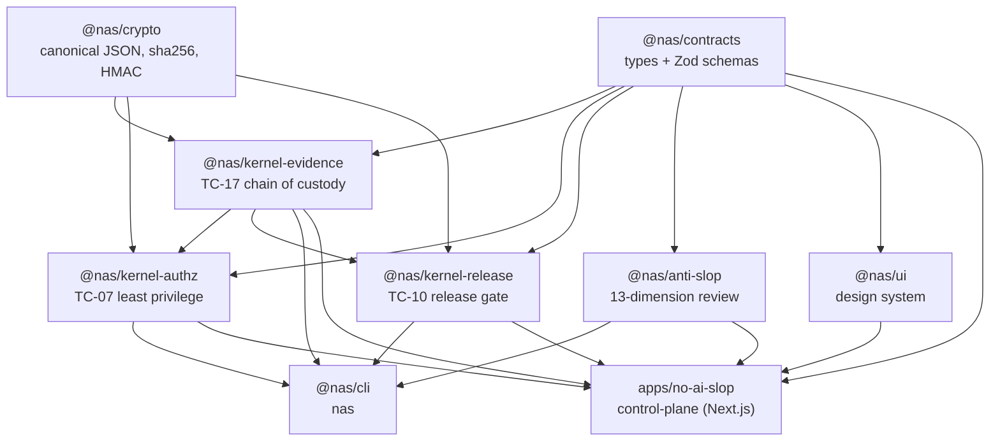
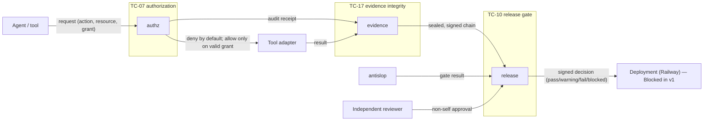
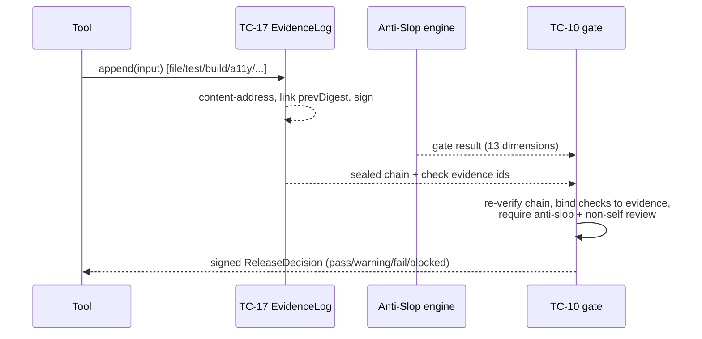

# No AI Slop — Architecture

A pnpm workspace monorepo built with TypeScript project references. Dependencies
flow one direction: contracts and crypto are the base; kernels build on them; the
CLI and app compose the kernels. Nothing lower depends on anything higher, and
there are no circular dependencies.

Since v1.1 this is **machine-checked, not prose**: layers and permitted edges are
data in [`docs/architecture/layer-rules.json`](docs/architecture/layer-rules.json),
the observed graph is scanned deterministically into
[`docs/architecture/observed-dependencies.json`](docs/architecture/observed-dependencies.json)
(freshness-tested), and `pnpm check:architecture` fails closed on any forbidden
edge, cycle, or undeclared module. The same-layer kernel edges
(`kernel-authz → kernel-evidence`, `kernel-release → kernel-evidence`) are
explicit, justified exceptions — visible in the check output and on the
control plane's `/system` view.
`node scripts/check-architecture.mjs --impact <file...>` maps changed files to
impacted modules, anti-slop dimensions, and required evidence kinds.

## Package graph

## Trust boundaries and the three kernels

Key invariants:

- **No agent action bypasses TC-07.** Authorization is deny-by-default; a grant
  must be authentically signed, unexpired, audience- and resource-bound, and
  non-replayed. Every decision emits an audit receipt that can be sealed as evidence.
- **No material claim bypasses TC-17.** Evidence is content-addressed,
  hash-chained, and signed by an authority whose key is held independently of
  producers. The release gate re-verifies the chain itself rather than trusting a flag.
- **No deployment bypasses TC-10.** The gate consumes only authenticated evidence,
  requires evidence-backed checks, an accepted anti-slop gate, and a non-self
  independent review, and signs its decision against the exact build.

## Evidence → decision data flow

## Runtime components

| Component | Runtime | Status |
| --- | --- | --- |
| `@nas/*` kernels, engine, crypto, contracts | Node (pure/library) | Verified |
| `nas` CLI | Node executable | Verified |
| Design-system registry + system checks | Pure data + pure functions (`@nas/ui`, `@nas/anti-slop`) | Verified |
| Architecture / design-system scanners | Node scripts (`scripts/check-*.mjs`) | Verified |
| Control-plane app (4 routes incl. `/system`) | Next.js 14 server + static | Verified (built + run) |
| Evidence store | Local filesystem (`.nas/evidence/chain.json`) | Verified |
| Signing authority | In-process HMAC keyring (interface ready for KMS/HSM) | Verified |
| Persistence / multi-tenancy | (design only) | Not tested |
| Deployment (Railway) | (config/model only) | Blocked |

## Failure & recovery (implemented today)

- **Tampered evidence** → chain verification fails → release gate returns
  `blocked`; the CLI `evidence verify` exits non-zero and refuses to load the chain.
- **Missing/incomplete inputs** → gate returns `blocked` with the exact reasons.
- **Unauthorized agent action** → deny-by-default with a machine-readable reason
  and an audit receipt.
- **Forged decision** → signature verification fails.

Infrastructure-level recovery (workspace restart, DB restore, deploy rollback) is
designed in the data/deployment model but **Not tested** in this environment.

## Known limitations (honestly disclosed)

- **Tail truncation of the evidence chain.** An append-only hash chain detects
  mutation, reordering, and mid-chain deletion, but cannot by itself detect that
  trailing records were never added — that requires an external head/length
  commitment. This is mitigated in practice at two layers: the release gate rejects
  a build that is missing any *required* evidence kind (so truncating required
  evidence is caught), and a signed release decision binds `inputsDigest` over the
  exact evidence set it evaluated. A future hardening is to anchor the expected
  chain head in the release manifest. Verified by adversarial testing: truncating a
  required record yields `blocked`.
- **`authorId` is caller-supplied.** The release gate binds self-review detection
  to the attributable build author (`manifest.createdBy`) as well as the supplied
  `authorId`, but full author attribution ultimately depends on the identity layer
  (Not tested in this environment).
